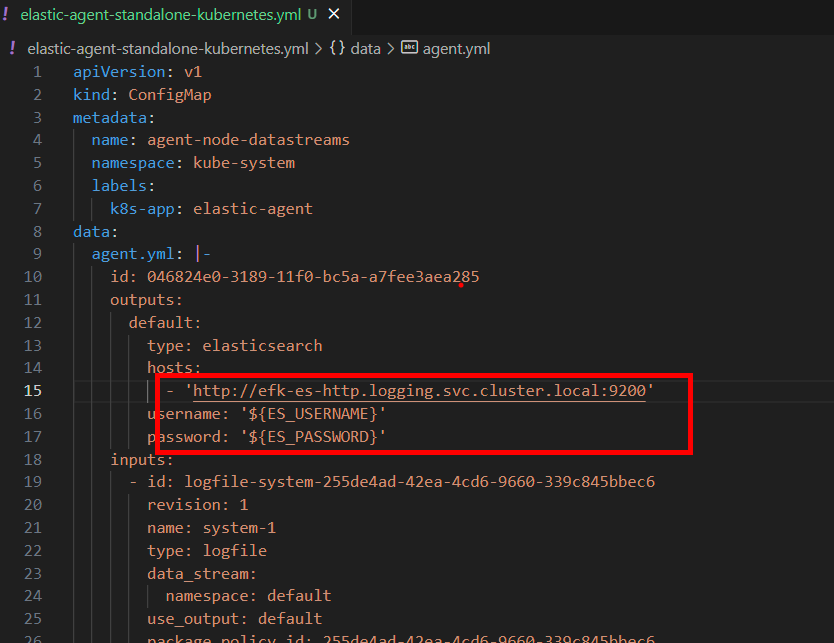

# Lab 08: Kibana & Alerting rules 

## 🌟 Objective

In this lab, you will configure Kibana. You will generate an Elastic Agent from Kibana and deploy it into your K3s environment to collect Kubernetes metrics and logs. These logs will be used for system observation, visualization, and creating alert rules for node health

---

## 🔧 Prerequisites

Ensure the following before proceeding:

1. **Elasticsearch and Kibana are installed and running**
2. **K3s cluster is operational and accessible**
3. **kubectl is configured and working**
4. **Internet access from the nodes (for pulling Elastic Agent)**

## 🧠 Step-by-Step Instructions


### 1️⃣ Login to Kibana Dashboard

* in case you need the password, run the below command and the default username `elastic` 
```sh 
kubectl get secret efk-es-elastic-user -n logging -o go-template='{{.data.elastic | base64decode}}'
```


---

### 2️⃣ Navigate to `Add Integrations` under Menu


---

### 3️⃣ Add Kubernetes Integrations


---


---

### 4️⃣ Select all the Collection and `Save and Continue`


---

### 5️⃣ Once Kubernetes Integrations added, select `Add Elastic Agent to yout hosts`


---


### 6️⃣ Under Add Agent, select `Run Standalone` and `Copy the Yaml Manifest to your editor` 

* name the file as `elastic-agent-standalone-kubernetes.yml`


---

### 7️⃣ You need to add/update 3 directive in the agent manifest before running it

* The First one, you need to update the elastic host to your elastic host
* to get the fqdn, on your k3s run : 
```sh 
kubectl get svc efk-es-http -n logging -o jsonpath='{.metadata.name}.{.metadata.namespace}.svc.cluster.local'
```
---



---

* the image name under Daemonset, need to be updated to reflect the elastic and kibana version 

* the proper container image name is `elastic/elastic-agent:8.11.3` 

* WARNING: ( Late Update ) : the below screenshot have error , the image name suppose to be `elastic/elastic-agent:8.11.3` and NOT `elastic/elastic-agent:8:11.3` 


---
* Finally, you need to update the password in the manifest file

* you can run this command in k3s to retrieve the password `kubectl get secret efk-es-elastic-user -n logging -o go-template='{{.data.elastic | base64decode}}'`


---
* Save the file and apply the file in kubernetes 

```sh 
kubectl apply -f elastic-agent-standalone-kubernetes.yml
```

* Verify the agents are running 

```sh 
kubectl get pod -n kube-system -l app=elastic-agent -o wide
```
>> there should be 3 agent running on all 3 nodes ( daemonset )


---
### 8️⃣ Verify the logs/metrics from elastic-agent are received in elastic/kibana 

--- 
* Under Index > Data Streams, you should able to see the ingested logs from agent


---
### 9️⃣ Verify under Data Views, 2 New Data Views are added automatically 
---


---
### 🔟 We can now consume the logs/metrics from k3s as Kubernetes Metrics/Logs 

* Use the default Kubernetes Kibana Dashboards 

* Explore other Kibana Dashboards as well 

---


---


---


### 1️⃣1️⃣ Create a Alert in Observability 
---


---


---
### 1️⃣2️⃣ To test the Alert , Stop k3s Service on on of the node

---


## 🚀 END