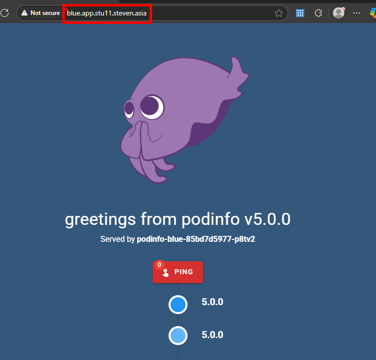
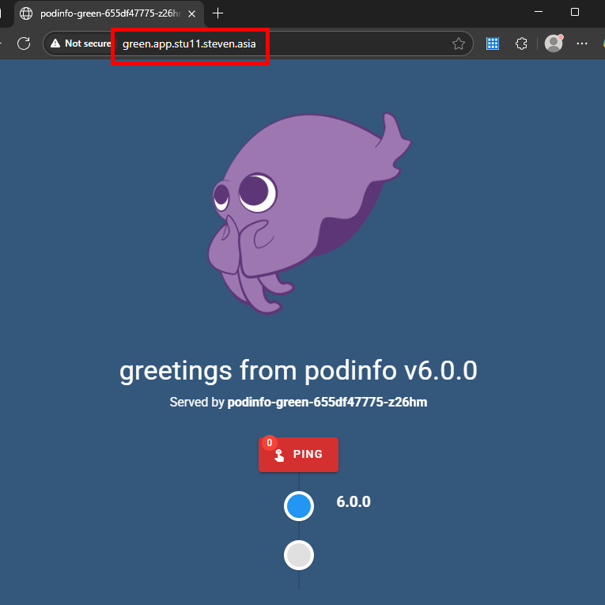
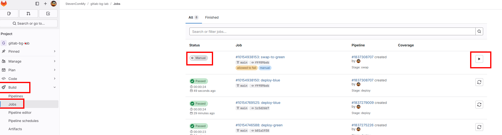
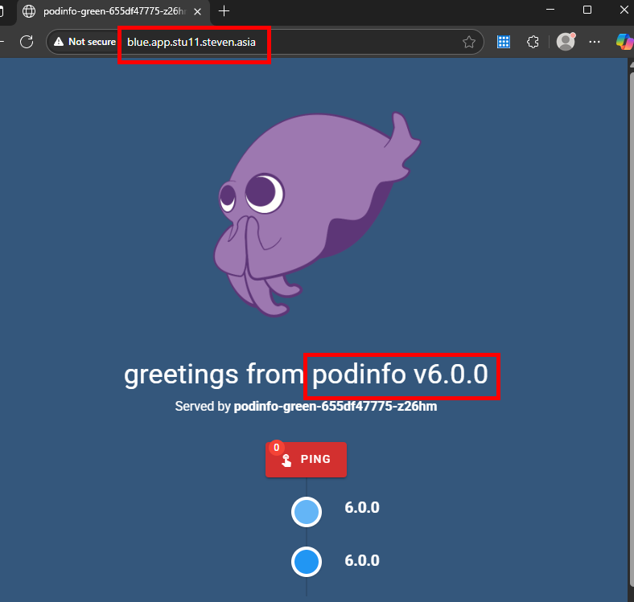

# 🧪 Lab 10: Blue/Green Deployment using GitLab CI/CD

## 🎯 Objective

Setup Shared Agent:
- Pre Setup : `Lab9 Agent` to be shared for `Lab10` 


Deploy two versions of `podinfo` using Blue/Green deployment strategy via GitLab CI/CD:
- `blue` version (v5.0.0)
- `green` version (v6.0.0)

---

## 📋 Step 1a: GitLab Repository Setup ( gitlab-bg-lab )

1. Go to [https://gitlab.com](https://gitlab.com) and log in.
2. Create a new project:
   - Name: **gitlab-bg-lab**
   - Visibility: **Private**
3. Clone the repo to your K3s VM (e.g., `vmk3s00X-stuXX`):

```sh 
cd ~ 
```
```bash
git clone git@gitlab.com:<your-username>/gitlab-bg-lab.git
```
```sh 
cd gitlab-bg-lab
```

```sh 
ls -l
```
>> Verify you have README.md (default) file 
---

## ⚠️ Pre Step 

1. If you recall, in Lab9, you have created the repo called `gitlab-ci-lab` 

2. In GitLab, the repo `gitlab-ci-lab` has your Kubernetes (k3s) agent 

3. We need to share that agent for the Lab10/Lab11 to work 

4. You need to do the following in K3s VM where the repo was cloned during lab9 run: 


```sh 
cd ~/gitlab-ci-lab/
```

```sh 
mkdir -p .gitlab/agents/stuXX 
```
>> replace the XX with your student number


```sh 
cd .gitlab/agents/stuXX
```

* Inside this dir, cp the file `config.yaml` from `lab10/manifests/agent/`  dir 

```sh 
cp ~/k3s_dev_training/day2/lab10/manifests/agent/config.yaml .
```
* Edit the file and replace the marker `<gitlab_project_or_id>` with your gitlab id 

* Next, git add , git commit and git push 

```sh 
cd ~/gitlab-ci-lab/
git add .
git commit -m "Updated Shared Agent config.yaml"
git push origin main
```

---

## 📋 Step 1b: Verify the new Repo have connected to shared agent 

1. Go to [https://gitlab.com](https://gitlab.com) and log in.
2. Got Project **gitlab-bg-lab**
   - Operate > Kubernetes Cluster 
   - Visibility: **Shared Agents**

---


## 📁 Step 2: Copy Manifests Blue

1. Go to `gitlab-bg-lab` dir

```sh 
cd ~/gitlab-bg-lab
```

2. Copy the `blue/` folder into your GitLab repo.

```bash
cp -r  ~/k3s_dev_training/day2/lab10/manifests/blue/  . 
```

3. Go Through each files inside the blue/ directory and change according to your student number and Repo ID

```sh 
cd blue/
```

---
4. Open the following files and **replace all placeholders marked with** `# 🐳  Change this`:

| File                  | What to Change                           |
|-----------------------|------------------------------------------|
| `namespace.yaml`      | Replace `ci-bg-stuXX` with your actual namespace |
| `deployment.yaml`     | Replace `ci-bg-stuXX` with your actual namespace |
| `ingress.yaml`        | Replace `stuXX` in the `host:` with your ID and Replace `ci-bg-stuXX` with your actual namespace |
| `service.yaml`        | Replace `ci-bg-stuXX` with your actual namespace |

---


5. Create root `.gitlab-ci.yml` in the repo root 

```sh 
cd ~/gitlab-bg-lab
```

```bash 
cp -r  ~/k3s_dev_training/day2/lab10/manifests/root/.gitlab-ci.yml  . 
```
* Edit the file and set any Variables and Project/Agent Path 


6. Push only the **root** and **blue** folder :

```bash
cd ~/gitlab-bg-lab

git add .
git commit -m "Initial blue deployment"
git push origin main
```

> The GitLab pipeline will run using `.gitlab-ci.yml` to deploy the blue version.

---

## 🛠 Step 3: Verify Blue Deployment

```bash
kubectl get all -n ci-bg-stuXX
```

Visit:
```
http://blue.app.stuXX.steven.asia
```

You should see the `podinfo` with version 5 dashboard.

---



---

## 📁 Step 4: Copy Manifests Green

1. Go to `gitlab-bg-lab` dir

```sh 
cd ~/gitlab-bg-lab
```

2. Copy the `green/` folder into your `gitlab-bg-lab` GitLab repo.

```bash
cp -r  ~/k3s_dev_training/day2/lab10/manifests/green/  . 
```

3. Go Through each files inside the green/ directory and change according to your student number and Repo ID

```sh 
cd green/
```

---
4. Open the following files and **replace all placeholders marked with** `# 🐳  Change this`:

| File                  | What to Change                           |
|-----------------------|------------------------------------------|
| `deployment.yaml`     | Replace `ci-bg-stuXX` with your actual namespace |
| `ingress.yaml`        | Replace `stuXX` in the `host:` with your ID and Replace `ci-bg-stuXX` with your actual namespace |
| `service.yaml`        | Replace `ci-bg-stuXX` with your actual namespace |

---

5. Push the entire `gitlab-bg-lab` GitLab repo.

```bash
cd ~/gitlab-bg-lab

git add .
git commit -m "Initial Green deployment"
git push origin main
```

> The GitLab pipeline will run using `.gitlab-ci.yml` to deploy the green version.

---

## 🛠 Step 5: Verify Green Deployment

```bash
kubectl get all -n ci-bg-stuXX
```

Visit:
```
http://green.app.stuXX.steven.asia
```

You should see the `podinfo` with version 6 dashboard.

---



---


## 📋 Step 6: Swap from Blue/Green Deployment via Ingress 

* You will swap `green ( v6 ) to blue deployment` via `gitlab-ci`

1. Go to `gitlab-bg-lab` dir

```sh 
cd ~/gitlab-bg-lab
```

2. Copy the `stg/` folder into your `gitlab-bg-lab` GitLab repo.

```bash
cp -r  ~/k3s_dev_training/day2/lab10/manifests/stg/  . 
```

3. Go Through the file inside the stg/ directory and change according to your student number and Repo ID

```sh 
cd stg/
```

---
4. Open the following files and **replace all placeholders marked with** `# 🐳  Change this`:

| File                  | What to Change                           |
|-----------------------|------------------------------------------|
| `ingress.yaml`        | Replace `stuXX` in the `host:` with your ID and Replace `ci-bg-stuXX` with your actual namespace |


---

5. Push the entire `gitlab-bg-lab` GitLab repo.

```bash
cd ~/gitlab-bg-lab

git add .
git commit -m "Green to Blue Swap via Ingress"
git push origin main
```

> The GitLab pipeline will run using `.gitlab-ci.yml` , but swaping will NOT happen because of Manual Run.

---

## 🛠 Step 5: Verify Blue Deployment now should have version 6 podinfo

* Go to gitlab and check the Jobs under Build, you will have a manual run, exec the Manual Run 

---




---


* Visit:
```
http://blue.app.stuXX.steven.asia
```

You should see the `podinfo` with version 6 dashboard.

---



---

## ✅ Success Criteria

- `podinfo-blue` and `podinfo-green` deployments exist in `ci-bg-stuXX` namespace
- Service and Ingress successfully route traffic
- Blue is served first, then switched to green via GitLab pipeline

---