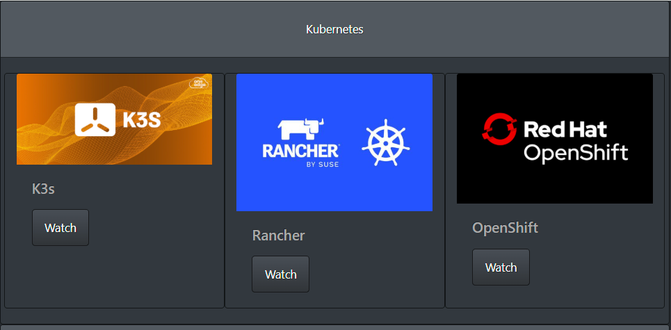

# Lab 15: Deploying Container Apps with Linkerd injection

# Part 1 
## 🎯 Objective

> ⚠️ This lab is designed for **k3s** and assumes you have a working cluster ready.

---
## 🛠️ Tasks Overview
---

## 🔧 Setup Instructions

### ✅ 1. Deploy Microservice 

* In this task, you will deploy a Sample YouTube Playlist MicroService
  >> This is a NOT a production Application!! You been WARNED!! 

---

* Create NS servicemesh-ns
```bash 
kubectl create ns servicemesh-ns
```
---
* Deploy Frontend web UI
```bash
kubectl create -f ./applications/videos-web/deploy.yaml
```
---
* Deploy Frontend Ingress 
* Edit the file and change the XX before deploying 
```bash
kubectl create -f ./applications/videos-web/videos-ingress.yaml
```
---
* Deploy the playlist api 
```bash
kubectl create -f ./applications/playlists-api/deploy.yaml
```
---
* Deploy the playlist api db

```bash
kubectl create -f ./applications/playlists-db/deploy.yaml
```
---
* Deploy Playlist Ingress 
* Edit the file and change the XX before deploying 
```bash
kubectl create -f ./applications/playlists-api/playlist-ingress.yaml
```
---
* Deploy the videos api and db

```bash
kubectl create -f ./applications/videos-db/deploy.yaml
```
---
* Deploy the videos api 
```bash
kubectl create -f ./applications/videos-api/deploy.yaml
```
---


### ✅ 2. Verify Deployment of Microservice
---
* Make sure all Pods are Running 
```bash
kubectl get all -n servicemesh-ns
```
---
* Make sure ingress in place for api(playlist) and web access (videos web) 
```sh 
kubectl get ingress -n servicemesh-ns
```
---
* Get the FQDN and browse to verify the App is working
```sh 
kubectl get ingress videos-web -n servicemesh-ns -o jsonpath="{.spec.rules[0].host}" | xargs -I{} echo "https://{}/home/"
```
>> should be an address like this *https://mesh.app.stuXX.steven.asia/home/* 

---
* Verify the API are responding: 
```sh 
curl -k  https://mesh.app.stuXX.steven.asia/api/playlists/ | jq 
```
>> replace the XX with your student number 

---

* Its should look like this: 




---
### ✅ 3. Download and Install linkerd 

* Do you Dive? like diving on Open Sea? 

* Make sure you are in home dir

```bash
cd ~ 
```

```sh 
curl --proto '=https' --tlsv1.2 -sSfL https://run.linkerd.io/install-edge | sh
```

```sh 
echo "PATH=$PATH:/home/droot/.linkerd2/bin" >> ~/.bashrc
```

```sh 
source ~/.bashrc
```

```sh 
linkerd version
```

* Check for Gateway API in the Kubernetes Cluster - Must return > v1.2.X

```sh 
kubectl get crds/httproutes.gateway.networking.k8s.io -o "jsonpath={.metadata.annotations.gateway\.networking\.k8s\.io/bundle-version}"
```

* Validate Kubernetes Cluster

```sh 
linkerd check --pre
```

* Install linkerd crd and install linkerd control plane

```sh 
linkerd install --crds | kubectl apply -f -
```

```bash
linkerd install | kubectl apply -f -
```

* run check to verify linkerd is installed 

```sh 
linkerd check
```

---
### ✅ 4. Install Grafana via helm ( For Visualization )

* Helm add grafana 
```bash
helm repo add grafana https://grafana.github.io/helm-charts
```

```bash
helm repo list 
```

* Use linkerd provided values.yaml to install grafana to attach grafana to linkerd viz 
```bash
helm install grafana -n grafana --create-namespace grafana/grafana -f https://raw.githubusercontent.com/linkerd/linkerd2/main/grafana/values.yaml
```

---

### ✅ 5. Install linkerd-viz extension to view Real Time Service Mesh Data


* Install linkerd viz using grafana internal url 
```bash
linkerd viz install --set grafana.url=grafana.grafana.svc.cluster.local  | kubectl apply -f -
```

* The access to Linkerd Viz’ Prometheus instance is restricted through the prometheus-admin AuthorizationPolicy

* In order to also grant access to Grafana, you need to add an AuthorizationPolicy pointing to its ServiceAccount. You can apply `authzpolicy-grafana.yaml` which grants permission for the grafana `ServiceAccount`.

```sh 
kubectl apply -f https://raw.githubusercontent.com/linkerd/linkerd2/refs/heads/release/stable-2.13/grafana/authzpolicy-grafana.yaml
```


* Verify linkerd viz is good and running 
```sh 
linkerd check
```

---
### ✅ 6. Install and Enable Ingress for linkerd-viz so you can access securely 
 >> we are implementing Basic Auth, its not really Secure, but better then Nothing 

* We will run a shell script that will auto create user and password and inject that to Traefik Ingress 

* MAKE SURE you are in dir day3/lab15/

```bash
bash ./cmd/linkerd-viz-secure.sh
```

* Access the printed Address with your user name and password and verify linkerd-viz can be accessed with grafana attached


---

# Part 2 

## Inject Linkerd to Our Microservice and Check in Linkerd-Viz


* Your microservices (`videos-web`, `videos-api`, `playlists-api`, and both DBs) are all deployed under the namespace `servicemesh-ns`
* Everything is ready to be **injected with Linkerd** to observe them in **Linkerd Viz + Grafana**.

### 🎯 Objective:

* Enable **Linkerd sidecar injection** on all deployments in `servicemesh-ns`
* Verify traffic and telemetry appear in **Linkerd Viz dashboard**

---

### 🔧 Steps:

#### 🧬 1. Enable Namespace Injection

Annotate the namespace to enable automatic proxy injection:

```bash
kubectl annotate ns servicemesh-ns linkerd.io/inject=enabled
```

We need to annotate traefik ingress deployment as well 

```bash 
kubectl annotate deploy traefik -n kube-system linkerd.io/inject=enabled
```


```bash 
kubectl describe ns servicemesh-ns
```

---

#### 🔁 2. Restart All Deployments to Trigger Injection

This will force all deployments to be re-deployed with Linkerd sidecars:

```bash
kubectl rollout restart deployment -n servicemesh-ns
```

This will force all traefik deployments to be re-deployed with Linkerd sidecars: 

```bash
kubectl rollout restart deploy traefik -n kube-system
```

---

#### ✅ 3. Verify Sidecars Are Injected

Check that pods now contain the `linkerd-proxy` container:

```bash
kubectl get pods -n servicemesh-ns -o jsonpath="{range .items[*]}{.metadata.name}{'\t'}{range .spec.containers[*]}{.name}{'\t'}{end}{'\n'}"
```

You should see output like:

```
videos-web-xxxxx       videos-web   linkerd-proxy
playlists-api-xxxxx    playlists-api linkerd-proxy
...
```

---

#### 👁️ 4. Open Linkerd Viz & Observe Services

1. Go to `https://viz.app.stuXX.steven.asia`
2. Authenticate with your username/password
3. Navigate to **"Namespace" → `servicemesh-ns`**
4. You should now see:

   * Service-to-service traffic
   * Latency, success rate
   * Live tap and top of requests

>> change the XX with your student ID 

---

#### 🔥 5. Optional Cool Stuff

* Use:

```bash
linkerd viz tap deploy/videos-web -n servicemesh-ns
```

To live monitor traffic.

* Or:

```bash
linkerd viz top deploy/videos-web -n servicemesh-ns
```

To get a live metrics summary.

---


---

## 🧼 Cleanup

```bash

```

---

## ✅ Validation Checklist


