# 🧪 Lab 9: GitLab Setup and Self-Hosted Runner in K3s

## 🎯 Objective

By the end of this lab, you will:
- Create a GitLab.com account and repository
- Deploy a self-hosted GitLab Runner inside your assigned Kubernetes namespace
- Register the Runner to your GitLab project
- Validate the connection by running a simple pipeline

---

## 📋 Prerequisites

- K3s cluster running
- `kubectl` configured
- Helm installed (v3+)
- GitLab.com account

> 🧠 Your namespace: `ci-demo-<your-id>`  
> Example: `ci-demo-stuXX`

---

## 🛠️ Step 1: Create GitLab Account and Project

1. Go to [https://gitlab.com](https://gitlab.com) and **sign up** or **log in**.

---

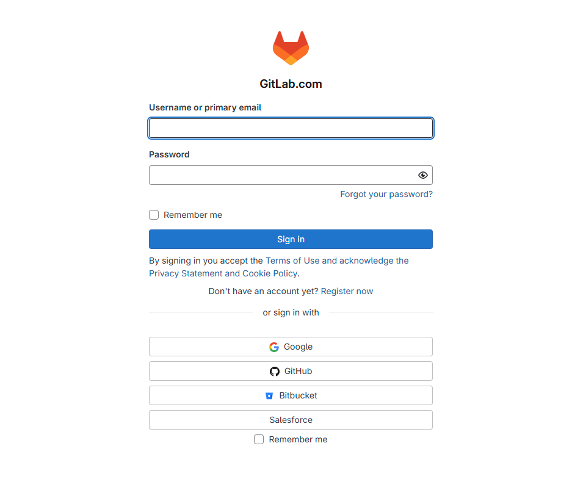

---


2. Click on **“New Project”**
---

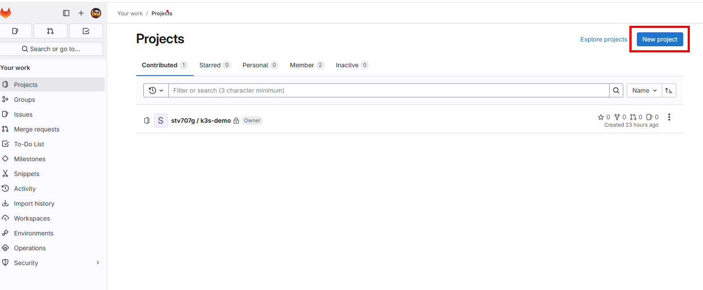

---


3. Choose:
   - **Blank project**
   - Project name: `gitlab-ci-lab`
   - Visibility: `Private`

---

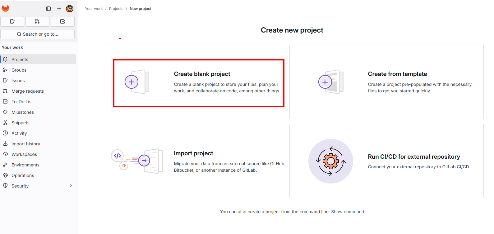

---


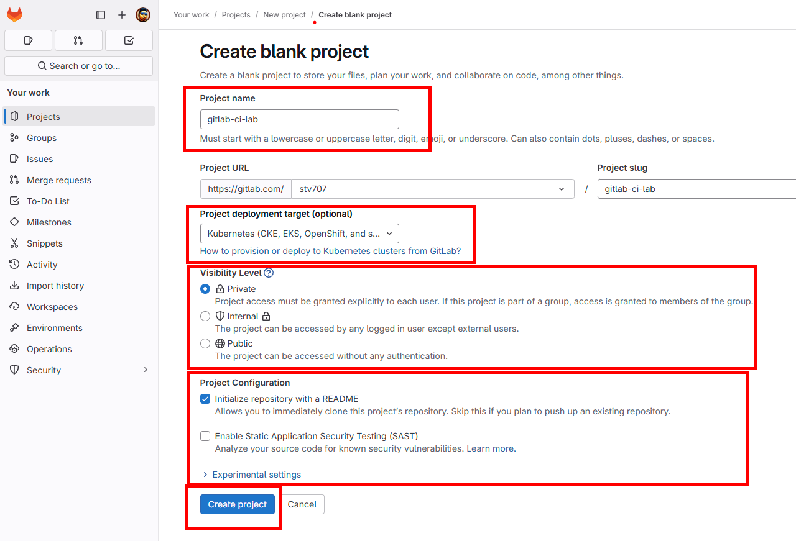

---

4. Generate ssh key from your assigned k3s machine terminal ( vmk3s00X )


```sh 
cd ~ 
```

```sh 
ssh-keygen -t rsa -b 4096 -f ~/.ssh/gitlab_key
```

```sh 
Generating public/private rsa key pair.
Enter passphrase (empty for no passphrase): <enter>
Enter same passphrase again: <enter> 
```

```sh 
Your identification has been saved in /home/droot/.ssh/gitlab_key
Your public key has been saved in /home/droot/.ssh/gitlab_key.pub
The key fingerprint is:
SHA256:MFZNTGXcbKi7TLUoK/NPHHGchpbccBM1Zb5mpw3348J8 droot@vmk3s003-stu0X
The key's randomart image is:
+---[RSA 4096]----+
|        .=+o**o.o|
|       . .oOoo++ |
|      +   *.*.  .|
|     . o ..+.   .|
|        S .+ . +.|
|        .++o. o..|
|         =*.d .  |
|      o ..Pump   |
|       +... E    |
+----[SHA256]-----+
```

* Copy the content of public key from output ( starting line `ssh-rsa` to end line `droot@vmk3s00X-stu0X` )

```sh 
cat .ssh/gitlab_key.pub
```

5. Add the Public Key to your gitlab account for cloning and pushing activity 

---

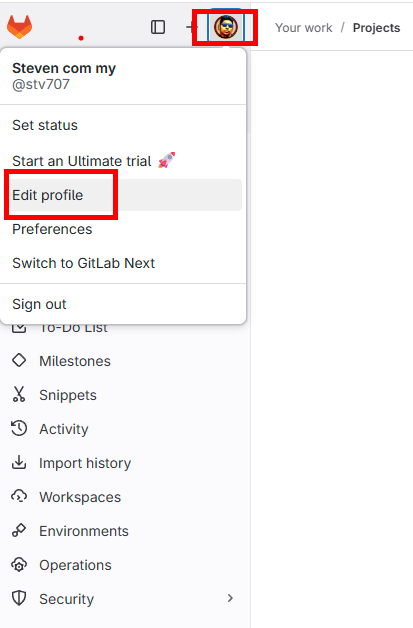

---

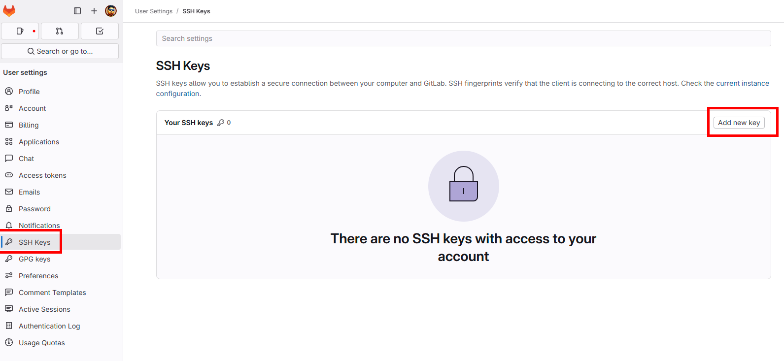

---

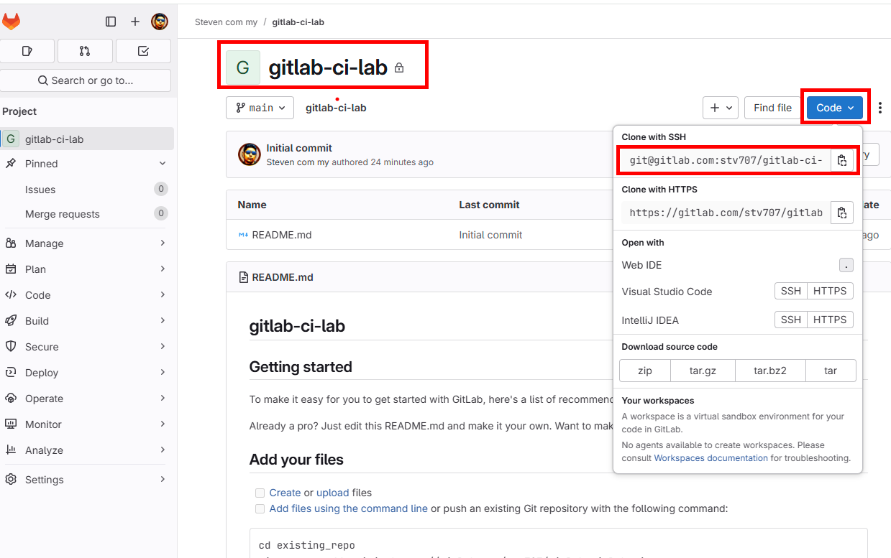

---


6. Clone the repo to your local machine:
 
 >> Before cloning, use ssh agent

   ```sh 
    eval $(ssh-agent)
   ```

   ```sh
   ssh-add .ssh/gitlab_key
   ```


   ```bash
   git clone git@gitlab.com:<YourUsername>/gitlab-ci-lab.git
   cd gitlab-ci-lab
   ```

---

## 🐳 Step 2: Install GitLab Runner in Your K3s Namespace

> We’ll install GitLab Runner using Helm into your assigned k3s.

1. Create a gitlab Kubernetes Runner Agent

---

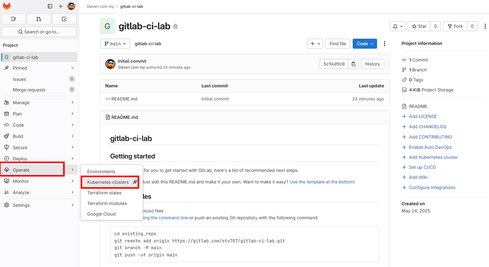

---

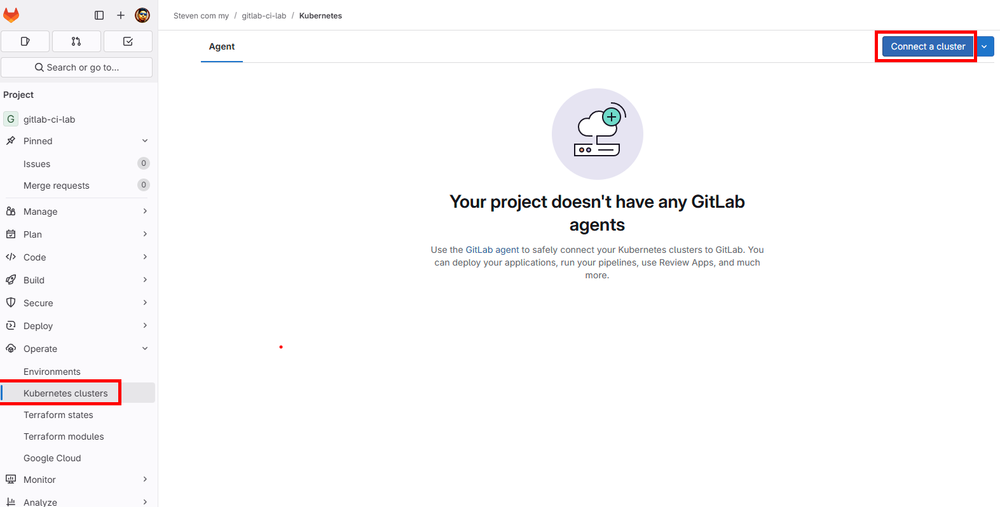

---

* Replace the XX with your student number
---

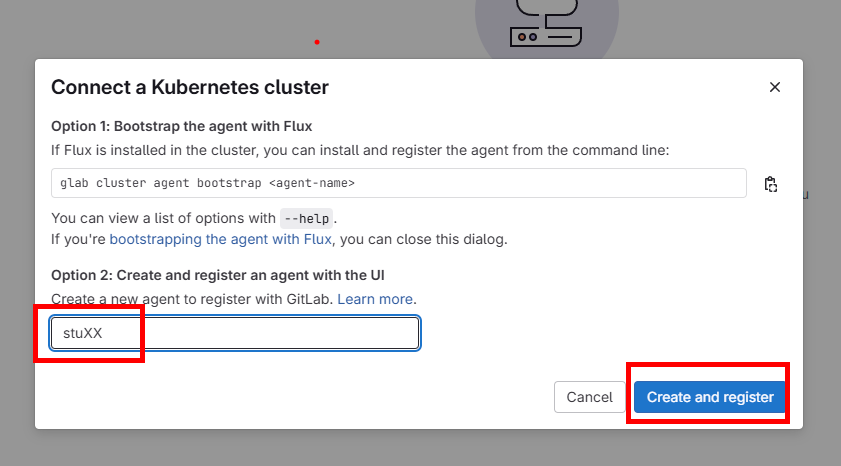

---

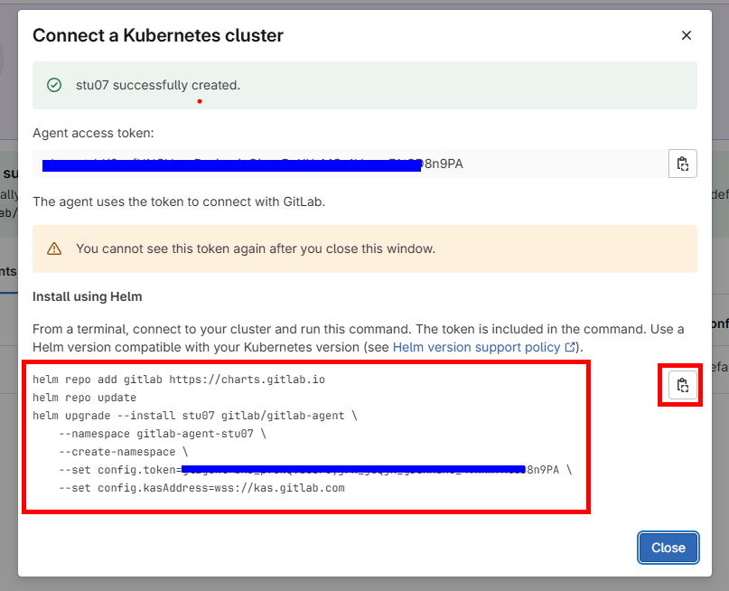

---

* Run the copied command on your k3s Terminal 

```sh 
helm repo add gitlab https://charts.gitlab.io
helm repo update
helm upgrade --install stuXX gitlab/gitlab-agent \
    --namespace gitlab-agent-stuXX \
    --create-namespace \
    --set config.token=XXXXXXXXXXXXXXXXXXXXXXXXXXXXXXXXXXXXXXXXXXX8n9PA \
    --set config.kasAddress=wss://kas.gitlab.com

```

* The following output confirms the installation of GitLab Agent into your k3s

```sh 
"gitlab" has been added to your repositories
Hang tight while we grab the latest from your chart repositories...
...Successfully got an update from the "gitlab" chart repository
Update Complete. ⎈Happy Helming!⎈
Release "stuXX" does not exist. Installing it now.
NAME: stuXX
LAST DEPLOYED: Sat May 24 08:47:11 2025
NAMESPACE: gitlab-agent-stuXX
STATUS: deployed
REVISION: 1
TEST SUITE: None
NOTES:
Thank you for installing gitlab-agent.

Your release is named stuXX.
```

---


## 🔑 Step 3: Verify the GitLab runner is running in your k3s Cluster

* Verify the agent is running in your defined namespace 

```sh 
kubectl get all -n gitlab-agent-stuXX
````

---

## ✅ Step 4: Validate Runner is Online


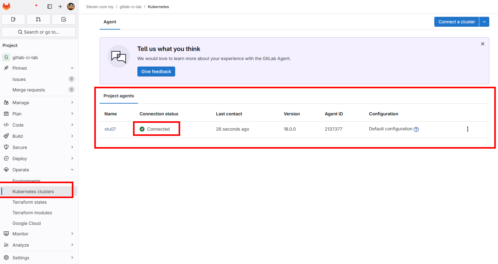

---

## 🧪 Step 5: Validate Kubernetes Agent with a Real Deployment

Now that your agent is installed and connected, let's test it by deploying a sample application using GitLab CI/CD and Kubernetes manifests.

---

### 1. Copy the provided `manifest/` directory into your GitLab repository

```bash
cp -r /home/droot/k3s_dev_training/day2/lab9/manifest/*.*  ~/gitlab-ci-lab/
```

```bash
cp -r /home/droot/k3s_dev_training/day2/lab9/manifest/.gitlab-ci.yml  ~/gitlab-ci-lab/
```

```sh 
cd ~/gitlab-ci-lab/
```

---

### 2. Edit Each File Inside `gitlab-ci-lab/` repo

Open the following files and **replace all placeholders marked with** `# 🐳  Change this`:

| File                  | What to Change                           |
|-----------------------|------------------------------------------|
| `.gitlab-ci.yml`      | `AGENT_KUBECONTEXT`, `KUBE_NAMESPACE`, `stuXX` in hostname |
| `namespace.yaml`      | Replace `ci-demo-stuXX` with your actual namespace |
| `deployment.yaml`     | If you’re using `kubia`, leave it as-is |
| `ingress.yaml`        | Replace `stuXX` in the `host:` with your ID |
| `service.yaml`        | Replace `ci-demo-stuXX` with your actual namespace  |

---

### 3. Commit and Push Your Changes

```bash
git add .
git commit -m "Updated manifest for student namespace"
git push origin main
```

>> if you receive `Author identity unknown ***Please tell me who you are`

>> Consider taking a cup of coffee and rethink, **is git really for you?** 

>> git was started by Linus Torvalds `(Linus Torvalds is the creator of Linux Kernel)`

>> He called git: `the stupid content tracker` 


---

### 4. Verify Your Pipeline and Deployment

- Go to **Build > Jobs** in Your GitLab Repo.
- Confirm that the pipeline/jobs runs and completes.
- Use the following command to verify on K3s:

```bash
kubectl get all -n ci-demo-stuXX
```

---

## ✅ Success Criteria

- GitLab runner is **installed in K3s**
- Runner appears  **“Connected”**
- A test pipeline job runs and completes successfully

---
