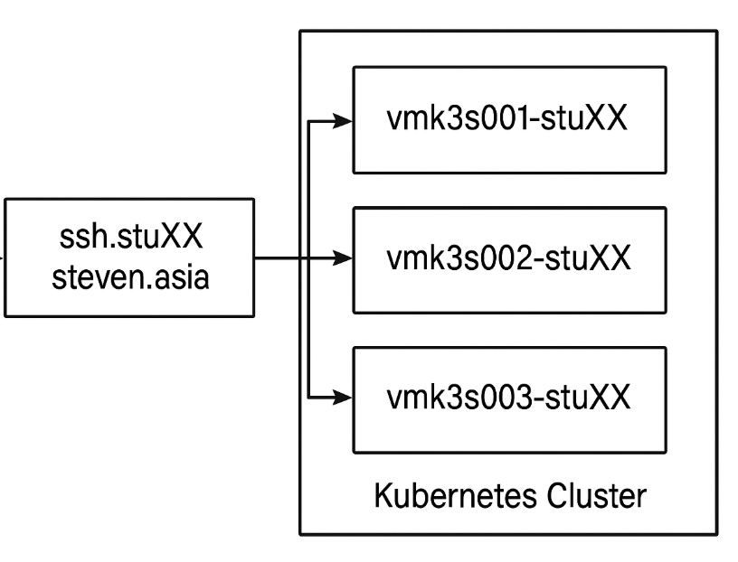

---

# K3s Infrastructure Track Labs for Qinetics

Welcome to the hands-on lab repository for the **K3s Infrastructure Track Training**. This training is structured over 3 days and contains a series of practical labs to help you master Kubernetes cluster operations, monitoring, service mesh, and disaster recovery using K3s and Linkerd.

---

### 🚀 How to Access Your Lab Environment

Each participant will be provided access to their own Kubernetes cluster, hosted on a dedicated virtual environment.

---
### 🚀 Software

The following software/cloud service may be useful in the labs and will make your life easier

* WSL Linux - https://learn.microsoft.com/en-us/windows/wsl/install
* VS Code - https://code.visualstudio.com/
* Lens Desktop - https://k8slens.dev/
* Git Hub - https://github.com/
* git - https://git-scm.com/downloads
* kubectl - https://kubernetes.io/docs/tasks/tools/install-kubectl-windows/

>> WSL Linux is only for Windows Desktop/Laptop, if you are using Mac or Linux, You're GOOD to GO! 😎

---

### 🔐 SSH Access

Use the following SSH command to connect to your assigned lab environment via jumphost:

```bash
ssh droot@ssh.stuXX.steven.asia
````
>> You must have linux(wsl) or Windows Powershell Terminal to access jumphost

>> Replace `XX` with your assigned student number.

>> ⚠️ The temporary password will be given to you during the training session.

>> ⚠️ You are expected to change the password to protect your Lab Env.

---

### 👥 Student-to-Cluster Mapping

| Student No  | SSH Host                         | Assigned Student     |
| ------------ | -----------------------------  | ------------------ |
| stu01    | `droot@ssh.stu01.steven.asia` | Chan Chin Keong         |
| stu02    | `droot@ssh.stu02.steven.asia` | Darren Lai Tye Jie  |
| stu03    | `droot@ssh.stu03.steven.asia` | 	Dixon Lee Ching Kiat        |
| stu04    | `droot@ssh.stu04.steven.asia` | Mohamad Marwan    |
| stu05    | `droot@ssh.stu05.steven.asia` | Mohamad Nazri       |
| stu06    | `droot@ssh.stu06.steven.asia` | Neoh Suen Hong      |
| stu07    | `droot@ssh.stu07.steven.asia` | 	Nooi Yong Qing      |
| stu08    | `droot@ssh.stu07.steven.asia` | 	Yap Weng Yang     |
| stu09    | `droot@ssh.stu07.steven.asia` | Steven Nagen      |

---

Each cluster is isolated, and you’ll have full `sudo` access via the `droot` account to complete the exercises in this repository.

--- 

## 🚀 Lab Setup overview 



---

# ⚠️ Warning ! 

* ⚠️ Lab Usage Policy – READ THIS OR REGRET LATER ⚠️
* 🚫 Do NOT abuse the machine provided to you 
  >> this environment is monitored and any misuse is unacceptable.

* 🔒 Any form of abuse will result in immediate revocation of access! 
  >> No exceptions, No appeals.
---

* 🧪 Do NOT attempt any lab exercise unless explicitly instructed by Steven.
  >> Some labs have interdependencies, and jumping ahead without supervision will break things 
  
  >>  **if you break things, then you own the mess you create**
---

* 👊 This is your only warning.
  >> If you act like a cowboy, don’t expect support when it blows up in your face.

---
>> Happy hacking! Happy Learning! 🚧

>> www.steven.com.my


